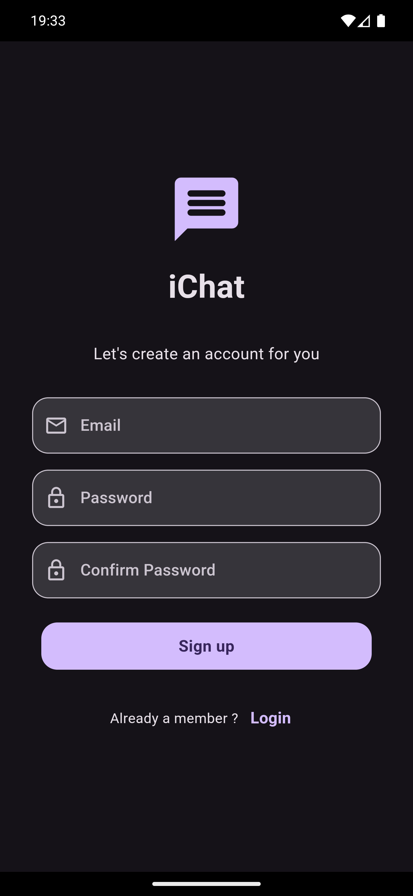
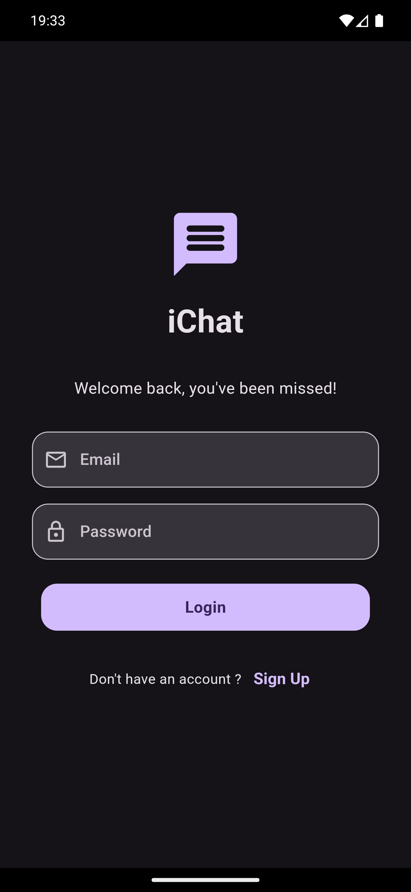
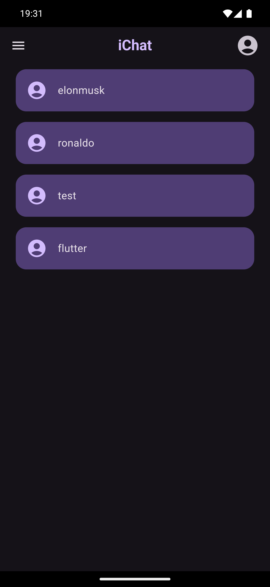
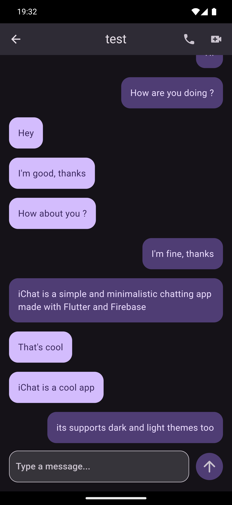
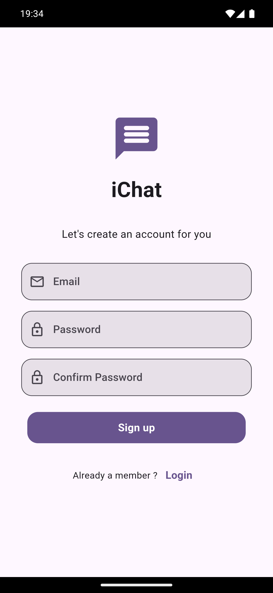
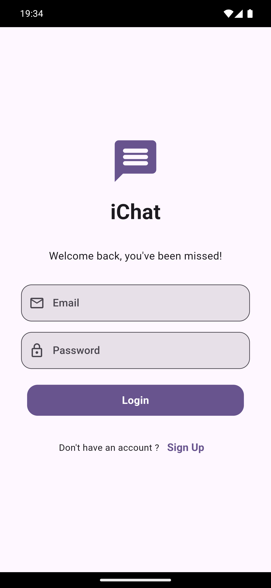
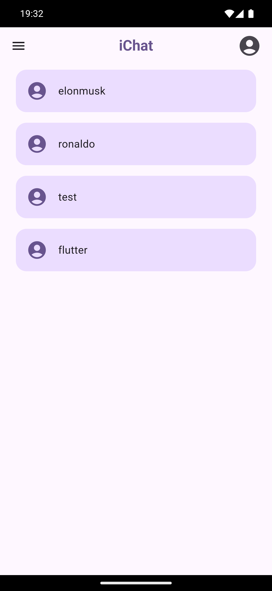
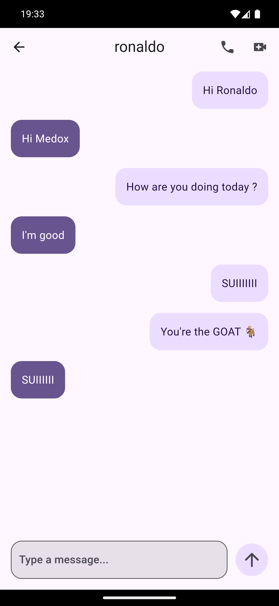

# iChat

A minimal chat application made in Flutter and Firebase.

## Screenshots

### Dark Mode

| **Sign up** | **Sign in** | **Home** | **Chat** |
| --- | --- | --- | --- |
|  |  |  |  |

### Light Mode

| **Sign up** | **Sign in** | **Home** | **Chat** |
| --- | --- | --- | --- |
|  |  |  |  |

## Getting Started

### Prerequisites

- Flutter SDK [official Flutter website](https://flutter.dev/docs/get-started/install).

### Installation

1. Clone the repository:

   ```bash
   git clone https://github.com/MrMDrX/iChat.git
   ```

2. Navigate into the project directory:

   ```bash
   cd iChat
   ```

3. Install the dependencies:

   ```bash
   flutter pub get
   ```

4. Run the application:

   ```bash
   flutter run
   ```

## Contributing

We welcome contributions! If you have suggestions or improvements, please open an issue or submit a pull request.

## License

This project is licensed under the MIT License - see the [LICENSE](LICENSE.md) file for details.